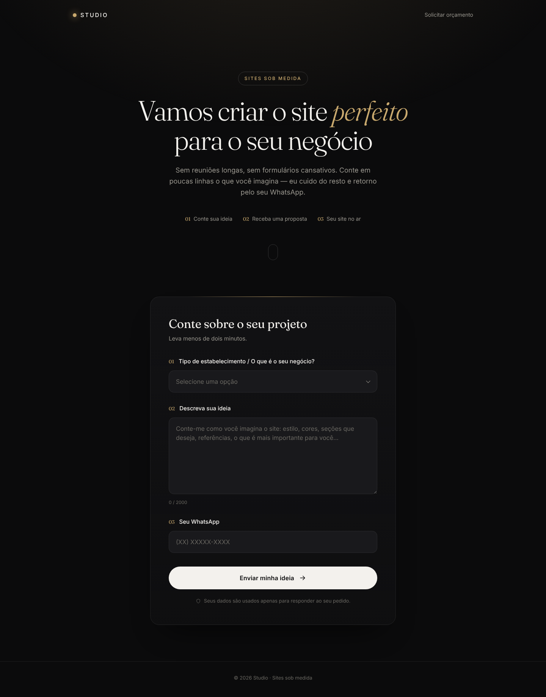
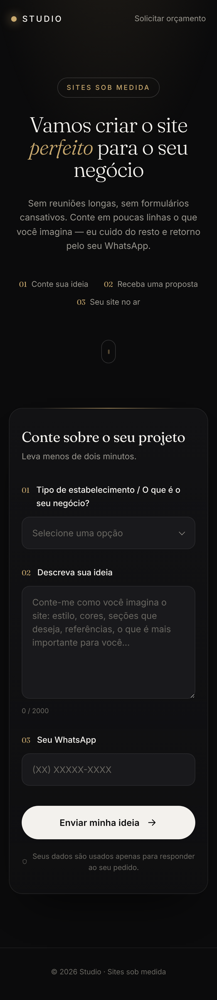
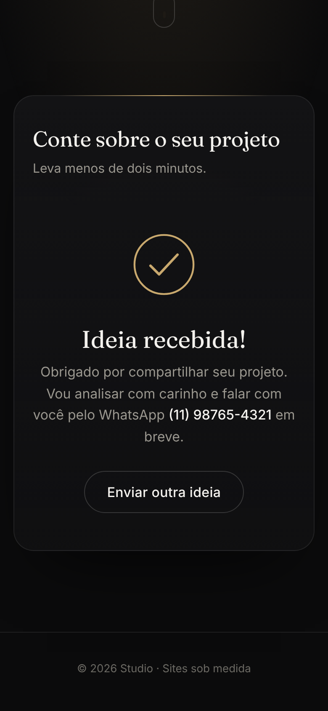

# Pedidos de site · Formulário para o WhatsApp

Página de captura de pedidos de criação de sites. O cliente escolhe o tipo de
negócio, descreve a ideia e informa o WhatsApp. Ao tocar em **Enviar minha
ideia**, a mensagem chega no **seu** WhatsApp e o WhatsApp do cliente
**não** é aberto.

Feito só com **HTML, CSS e JavaScript puro**. Não precisa de build: é só subir
a pasta para qualquer hospedagem (GitHub Pages, Netlify, Vercel, Hostinger…).

## Prévia

| Computador | Celular | Após o envio |
|---|---|---|
|  |  |  |

```
pedidos/
├── previa/        Capturas de tela da página
├── index.html      Estrutura da página (hero + formulário + sucesso)
├── css/style.css   Visual (cores, fontes, animações)
└── js/
    ├── config.js   ← É AQUI QUE VOCÊ EDITA (seu número e forma de envio)
    └── app.js      Máscara, validação, montagem e envio da mensagem
```

---

## Por que não dá para usar só o link do WhatsApp?

Links como `wa.me/55119...?text=...` (e o `window.open` do WhatsApp Web)
sempre abrem o **WhatsApp de quem clicou**, e é essa pessoa que precisa tocar
em "Enviar". Para a mensagem chegar sem abrir nada para o cliente, outro
serviço precisa enviá-la por você. Por isso o site tem três modos, escolhidos
em `js/config.js`:

| Modo | Abre o WhatsApp do cliente? | Configuração |
|------|-----------------------------|--------------|
| `"callmebot"` (padrão) | **Não** | 2 minutos, grátis |
| `"webhook"` | **Não** | Precisa de um endpoint seu |
| `"link"` | Sim (plano B) | Nenhuma |

---

## 1. Configurar o CallMeBot (recomendado, grátis)

O [CallMeBot](https://www.callmebot.com/blog/free-api-whatsapp-messages/) é um
serviço gratuito que manda mensagens de WhatsApp **para o seu próprio número**.

1. Salve o número do CallMeBot nos seus contatos. O número atual está na
   página do link acima.
2. Pelo seu WhatsApp, mande para ele a mensagem:
   `I allow callmebot to send me messages`
3. Você recebe uma resposta com a sua **apikey** (ex.: `123456`).
4. Abra `js/config.js` e preencha:

```js
window.CONFIG = {
  meuWhatsApp: "5511999999999",   // seu número com DDI 55 + DDD
  modoEnvio: "callmebot",
  callmebotApiKey: "123456",      // a apikey que você recebeu
  ...
};
```

Pronto: cada pedido chega no seu WhatsApp, enviado pelo número do CallMeBot.

> A apikey fica visível no código da página. O pior que alguém pode fazer com
> ela é mandar mensagens **para você**: ela não dá acesso à sua conta. Se
> começar a receber spam, peça uma nova chave ao CallMeBot ou use o modo
> webhook.

## 2. Modo webhook (servidor próprio, Z-API, n8n, Make…)

Com `modoEnvio: "webhook"` e `webhookUrl` preenchido, o site faz um `POST` com
este JSON:

```json
{
  "destino": "5511999999999",
  "mensagem": "✨ *NOVO PEDIDO DE SITE* ...",
  "dados": {
    "negocio": "Restaurante",
    "ideia": "Quero um site...",
    "whatsapp": "(11) 98765-4321",
    "whatsappLink": "https://wa.me/5511987654321",
    "data": "09/10/2026",
    "hora": "14:32"
  }
}
```

Seu endpoint envia `mensagem` para `destino` pelo provedor que você usar
(WhatsApp Cloud API, Z-API, Evolution API, Twilio…) e responde com status 2xx.
Ele precisa aceitar requisições do domínio do site (CORS). Use esse modo se
quiser esconder as chaves do provedor.

## 3. Modo link (plano B)

Com `modoEnvio: "link"`, o site abre o WhatsApp do cliente numa nova aba com a
mensagem pronta. Não exige configuração, mas o cliente ainda precisa tocar em
"Enviar".

---

## Como a mensagem chega

```
✨ *NOVO PEDIDO DE SITE*

🏢 *Negócio:* Restaurante

💡 *Ideia do cliente:*
Quero um site elegante, com cardápio e reservas...

📱 *WhatsApp:* (11) 98765-4321
💬 Responder: https://wa.me/5511987654321

_Recebido em 09/10/2026 às 14:32_
```

Toque no link "Responder" para abrir a conversa com o cliente. Para mudar o
texto, edite a função `montarMensagem` em `js/app.js`.

## Outros detalhes

- **Máscara de telefone:** `(11) 98765-4321` para celular e `(11) 3333-4444`
  para fixo. Se o cliente colar o número com `+55`, o DDI é removido.
- **Anti-spam:** um campo invisível pega robôs, e o mesmo navegador só pode
  enviar de novo depois de `intervaloEntreEnvios` segundos (padrão: 60).
- **Nome da marca:** troque "Studio" no `index.html` (topo e rodapé).
- **Cores:** ficam nas variáveis do início de `css/style.css`. O dourado é
  `--gold`. Para um azul discreto, use algo como `#7c9cc9`.
